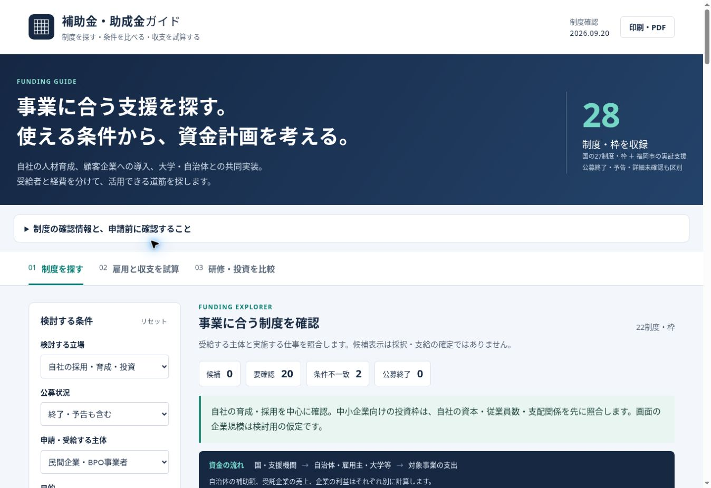

# 補助金・助成金ガイド

AI実装・人材育成・研究開発に関する制度探索と条件付き試算のWebアプリです。公開情報を使った独立した検討用ツールです。

樋口隆史が国の制度調査・用途の拡張・条件で結果が変わるツール化を要求し、AIが資料確認、制度データ、画面、計算式、テストを作成しました。本人の要求とAIの調査・修正を[開発記録](docs/DEVELOPMENT.md)に、2アプリ全体の位置づけを[トップREADME](../README.md)に記載しています。

**情報確認基準：2026年9月20日。** 国の27制度・枠と福岡市の実証支援1件を収録。これは受給できる補助金の件数ではありません。公募終了・予告・詳細未確認、委託研究・返済型資金・現物支援も区別して掲載します。全国の全制度を網羅したものではありません。



## 解決する問題

補助上限だけを並べると、受給者が違う資金や対象外の費用まで足し合わせがちです。企業規模や資本関係が制度ごとに異なるため、受給資格を推定だけで確定できません。アプリでは次を分けます。

- 自社：従業員の採用・育成、自社投資。
- 顧客企業：顧客が申請・受給し、提供事業者がAI導入や研修の提供を検討。
- 大学・自治体等：交付先と共同研究・受託先を区別。

## 使える機能

1. 立場、申請主体、目的、企業規模、支配関係、公募状況などで制度を絞り込む。
2. 人数・勤務時間・賃金・入金年を変え、雇用助成と3年間の簡易資金収支を比較する。
3. 6区分の設備・システム投資と、事業展開等リスキリング支援の研修を試算する。
4. 制度ごとの条件・併用制限・確認日・公式出典を読む。表示した画面を印刷・PDF保存する。

要件未確認の金額は算入せず、研修方式・人数・投資額・上限によって結果が変わります。研修は事業所・年度上限1億円の残額も反映します。試算結果は入力上の仮定であり、採択・支給・個別企業の受給資格を確定しません。

## 実行

画面だけを試す場合は、このフォルダーでPython 3の静的サーバーを起動します。

```sh
python3 -m http.server 4175 --bind 127.0.0.1 --directory dist
```

同じPCのブラウザーで`http://127.0.0.1:4175/`を開きます。Windowsでは必要に応じて`python3`を`py -3`に読み替えてください。

開発・回帰テストにはNode.js 22.12以上を使用します。このフォルダーで実行してください。

```sh
npm ci
npm run dev -- --host 127.0.0.1
npm test
```

画面本体は `dist/` にあるHTML/CSS/JavaScriptの静的ファイルです。任意の静的HTTPサーバーでも動作します。Viteは開発用で、本番の計算処理には不要です。LLM API・バックエンド・データベースは使いません。フォーム入力はブラウザ内で処理し、自動保存しません。配信基盤による認証・アクセスログ等は別です。

## 構成

| ファイル | 役割 |
| --- | --- |
| `dist/programs.js` | 28件の制度データ・出典・確認状態・活用案 |
| `dist/app.js` | 絞り込み、資格の注意表示、雇用収支、画面制御 |
| `dist/estimates.js` | 投資・研修の純粋な計算関数 |
| `dist/index.html` / `dist/styles.css` | 画面・表示・レスポンシブ対応 |
| `tests/funding.test.cjs` | 条件未確認、上限、対象外、二重計上防止等の回帰テスト |
| `docs/` | 調査出典、開発上の判断、実操作の検証記録 |

## AI駆動型開発として残す記録

[開発と判断](docs/DEVELOPMENT.md)、[調査出典](docs/SOURCES.md)、[検証結果](docs/VERIFICATION.md)を参照してください。AIによる実装だけでなく、一次資料との照合、誤った加算を防ぐ設計、実操作で発見・修正した点を残しています。

## 更新と限界

公募日程・助成率・上限・対象者・併用条件を公式の最新要領で確認し、`programs.js` と計算式を同時に更新してください。確認日だけを進めないでください。更新後は `npm test` と代表的な画面操作を再実施します。

税・会計利益・資金調達・費目別全条件・特例の全てを再現した申請エンジンではありません。新設法人の資料、株主構成、親会社の制度上の規模、従業員数、雇用保険・事業者登録は申請者ごとの確認が必要です。Go-Techは今回、現行要領を確認できず収録を保留しています。第三者資料の著作権は各権利者に帰属します。プロジェクト全体のOSSライセンスは未設定です。
